# How to install/setup Arch Linux (and get plasma KDE). It works for VM too...

Table of Content *(clickable link)*
- [How to install/setup Arch Linux (and get plasma KDE). It works for VM too...](#how-to-installsetup-arch-linux-and-get-plasma-kde-it-works-for-vm-too)
  - [1 Pre-installation](#1-pre-installation)
    - [1.1 Arch Linux .iso](#11-arch-linux-iso)
    - [1.2 Boot System](#12-boot-system)
    - [1.3 USB Driver Boot](#13-usb-driver-boot)
    - [1.4 Boot the live environment](#14-boot-the-live-environment)
    - [1.5 Disable Secure Boot](#15-disable-secure-boot)
  - [2 Arch Linux Installation](#2-arch-linux-installation)
    - [2.1 Booting your Arch Linux .iso](#21-booting-your-arch-linux-iso)
    - [2.2 Verify the boot mode](#22-verify-the-boot-mode)
      - [2.2.1 Connect by Wi-Fi](#221-connect-by-wi-fi)
    - [2.3 Update the system clock](#23-update-the-system-clock)
    - [2.4 Partitioning the disks](#24-partitioning-the-disks)
    - [2.5 Format the partitions](#25-format-the-partitions)

<details><summary>Note to the user, before you follow this tutorial (drop-down) </summary>

I'm just a CS student trying new things, for example Arch Linux. This tutorial is not 100% bug proof (I can assure you it works tho...), i'm still trying Arch Linux and i'm not an expert of this distro. If you stumble upon problems I didn't cover up, please search on the official [Arch Linux documentation](https://wiki.archlinux.org/title/Installation_guide) or the [Arch Linux forums](https://bbs.archlinux.org/) or even on the internet in general. I'm not responsible if anything bad happens to your system while you're following this tutorial. As I said earlier, i'm still learning too Arch Linux, it's a way to teach the new people with this distro and help me learning too. Anyway, i hope you enjoy this tutorial and have fun with Arch Linux!


If you have any tips/recommendation or even flaws inside my tutorial (since i'm not an expert, there are flaws that i'm not aware). Contact me either through [discord](https://discordapp.com/users/484713064655224854) or through my mail which is gael.rothlin@proton.me
</details>

## 1 Pre-installation
### 1.1 Arch Linux .iso
Get the latest Arch Linux .iso, at this moment it is the "archlinux-2024.09.01-x86_64.iso" be aware that the version number may change in the future. You can download the latest .iso by going on the Arch Linux website by clicking on this [link](https://geo.mirror.pkgbuild.com/iso/2024.09.01/). If this link doesn't redirect you to the .iso page, click on this [link](https://archlinux.org/download/). It will redirect you to the archlinux general download page.

### 1.2 Boot System
You can boot by many ways, here's the list on how you can boot Arch Linux on your computer :
- USB Driver
  - There's two way to install Arch Linux with a USB Driver, the first is for a full installation called a "Install Arch Linux on a removable medium" and the second option is installing Arch Linux as a rescue USB with "chroot" or "Rufus". Rufus is a utility for formatting and creating bootable USB media, such as USB sticks, flash memory and so on. (I, personally, use Rufus when doing Linux Installation)
- Optical Disc
  - I will not explain how to install Arch Linux with an optical disc, because it's not the most common way to install (maybe i'm wrong but i didn't heard much of this way inside the Arch community) and i'm not an expert with this way of installing Arch Linux
- PXE (through network)
  - Preboot eXecution Environment (PXE, most often pronounced as pixie). I will also not cover this way of installing Arch Linux to avoid leading you the wrong way and not being able to help you if you have any problem with this way of installing Arch Linux.

### 1.3 USB Driver Boot
(Need to work on that... )

### 1.4 Boot the live environment
**Note** : Arch Linux installation images do not support Secure Boot. You will need to disable Secure Boot and if you want to set Secure Boot after, it is possible after completing the installation

### 1.5 Disable Secure Boot
The Secure Boot can be disabled via the UEFI interface. You can access the firmware configuration by pressing "Esc", "F2", "Del", or possibly "Fn" key. Sometimes the right key is displayed for a short time while the boot process. And when you access the UEFI interface, you'll need to find the label "Secure Boot" and turn it off

## 2 Arch Linux Installation
### 2.1 Booting your Arch Linux .iso
After choosing your Live System, you will find yourself to a similar menu of the following screenshot. If you have the same menu then you got an .iso with UEFI support (this menu is a grub menu). And if your menu is different don't panic, you got an .iso that has a BIOS support. To save some times to people who has a BIOS support, i'm not doing a tutorial for BIOS support for the moment but I will in the future, for now it will be a tutorial for UEFI support.

When you get to this menu, please select the one that says "Arch Linux install medium (x86_64, x64 UEFI)" or something similar if you don't have the same numbers as me.
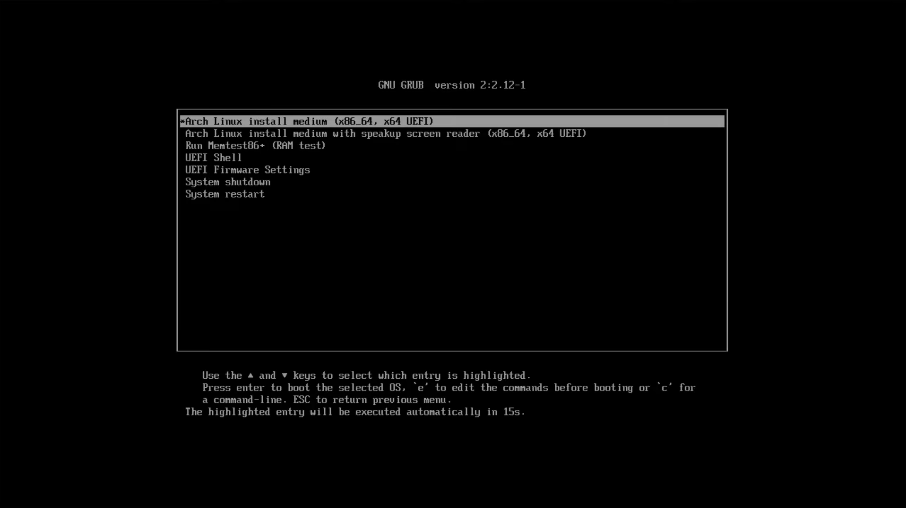
After doing so, you will see the booting process of your .iso and you will see a new terminal design such as the following screenshot.

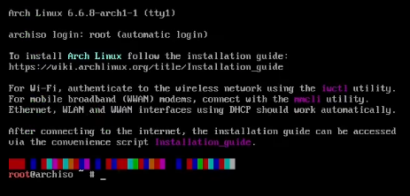

First things first, you want to have the right keyboard layout. If your layout, by default, is a "qwerty" then you don't need to bother with this. But for example, your keyboard layout is an "azerty" for french, or a deutsch layout, etc... then you need to run the command
```
# localectl list-keymaps
```
to get the name of the layout you need.
```shell
fr-latin1 # for French layout
de-latin1 # for German layout
...
```
To change the keyboard layout(to the french layout...), run the command
```
# loadkeys fr-latin1
```
or any language you want

---

After changing your keyboard layout, you can change the style/weight of your font in the terminal. I recommand doing this, since the original font is very small and thin.
```
# setfont ter-124b 
```
or you can put 132 instead of 124, it's up to you and the higher the number is the bigger your font will be...

### 2.2 Verify the boot mode
To verify the boot mode, you can run the command
```
# cat /sys/firmware/efi/fw_platform_size
```
If  the output is 0 then you are in BIOS mode, if the return is 32 then the system if booted is in UEFI mode and if the return is 64 then your UEFI is a 64-bits x64 UEFI.

Important if you're doing a Arch Linux VM, if you don't see any output when searching the efi folder that's because you didn't enable the EFI option before launching the VM. To solve this problem, you'll need to close the VM. Go to the `configuration` window on your VMware and toggle on the `Activate EFI` and toggle off the secure boot like the following screenshot. And just reboot your VM right after it.


And finally, you need to be connected to internet. You can do this by running the command
```
# ip link
# ping archlinux.org
```

by doing ip link, we can check if you have a connection "UP". If you don't see one, then you need to set it up.

You have three ways to connect your pc to internet :
- Ethernet :
  - Just plug in the cable
- Wi-Fi :
  - you'll need to use the command  `iwctl` to connect to your network.
- Mobile broadband modem :
  - connect to the mobile network with the `mmcli` command

#### 2.2.1 Connect by Wi-Fi
First, run the  command 
```
# iwctl
``` 
and if you don't know your wireless device name, run
```
[iwd]# device list
```
After seeing the listed devices name like the following screenshot
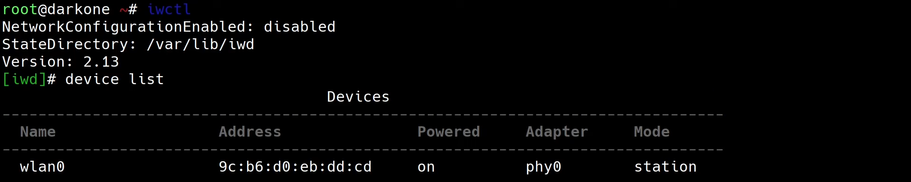 
Run the following commands to power on the device selected.
```
[iwd]# device (the name of the device, usually it's wlan0) set-property Powered on
[iwd]# station (the name of the device...) scan
[iwd]# station (the name of the device...) get-networks
```
You will see a list or not of network name, like the following screenshot.

Please select the one that fits the most your situation. After choosing your  network, run 
```
[iwd]# station (the name of the device...) connect (the name of the network you choose)
```
And enter your network password. You can now try 
```
# ping archlinux.org
```
Here is the screenshot of what you should see


### 2.3 Update the system clock
You can update the system clock by running the command :
```
# timedatectl
```

### 2.4 Partitioning the disks
We will use the GPT layout for UEFI for easier reason. 
The following command will list all the disks and partitions on your system.
```
# fdisk -l
```
You should see something similar to the next screenshot
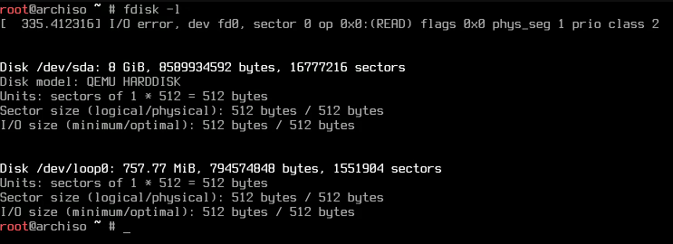

You can see the disk `/dev/sda` is the one we will use. You can use the following command to choose the layout of the partitioning we will use. In our case GPT
```
# fdisk /dev/sda
```
Before being able to choose your layout, your screen should look like this
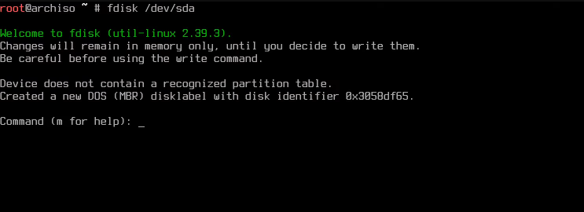

You can hit the key `m` to show up the help menu. But in our case we'll need to hit the key `g` to choose the GPT layout and the key `w` to write/save the modification and exit.

Now, we're going to partitionate the disk.
```
# cfdisk /dev/sda
```
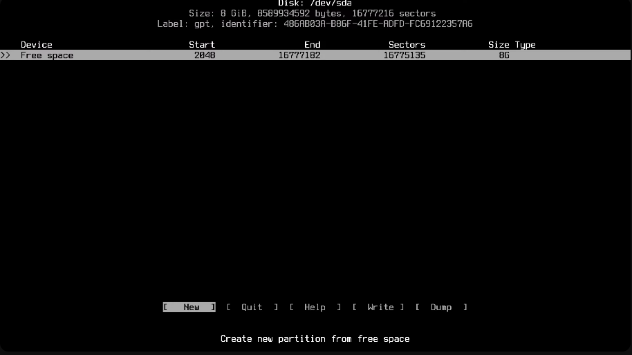

Now you can see there is an option called Free space, it's a disk that has n amount of free stockage. We will use this one to partition what we need.

You can move between the different options by using the arrow keys and select the option you want with `Enter` key.

Now hit the `New` button with your `Enter` key. It will change to `Partition size :`. You enter the size you want, but I recommend you to put at least 512M like the following screenshot.

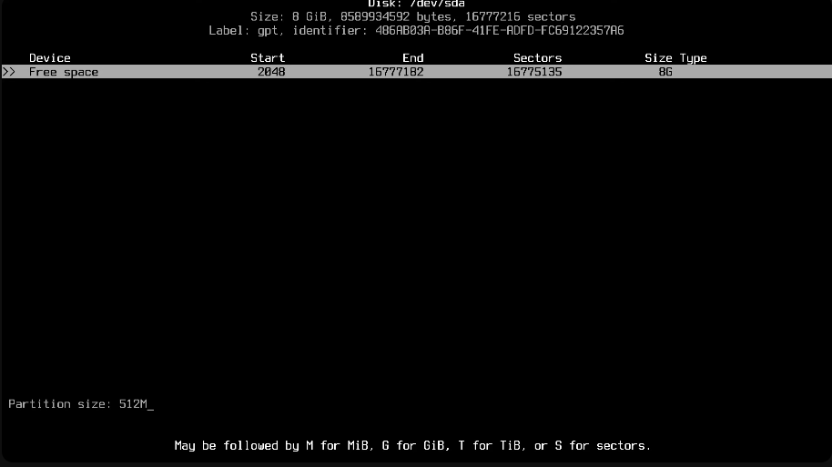

After this,you'll need to switch to the `Type` button with your arrow keys and select it and change the current type `Linux filesystem` to `EFI System`  like the following screenshot.

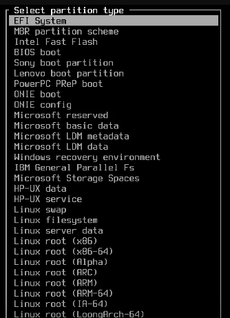

We'll need to hit a second time the `Free space` and put at least 1G, after setting the partition size on /dev/sda2, we will also change the type of /dev/sda2 to `Linux swap`, refer to the following screenshot.

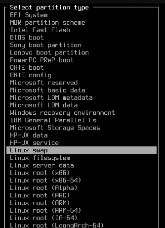
And finally, we'll hit a last time `Free space` and this will be our `/` partition, we will set the size to the rest of the disk. You can put the remaining size to this partition or any size you want or need.

After all of this, you should have something like this.

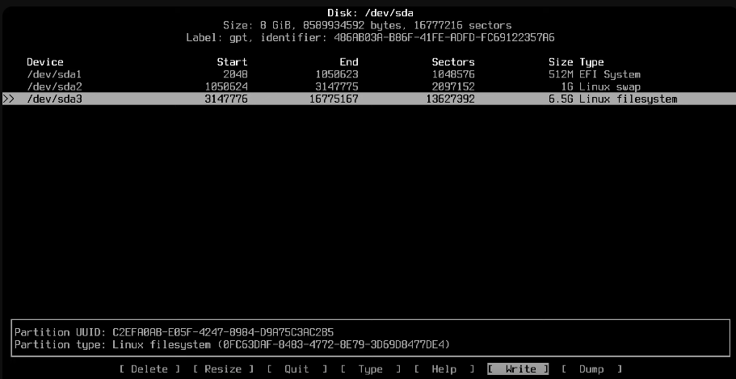

Hit the `Write` button to write and save your progression and `Quit` after.

### 2.5 Format the partitions

When finishing the partitioning, you will need to format the partitions. You can use the following command to format

```
# mkfs.ext4 /dev/sda3
```

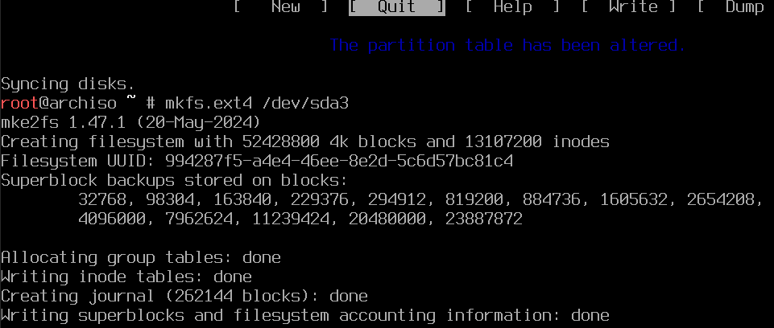

```
# mkfs.fat -F 32 /dev/sda1
```


```
# mkfs.swap /dev/sda2
```

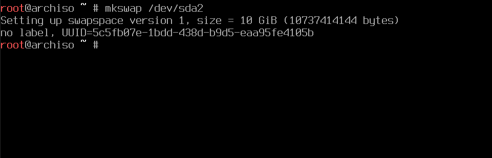
